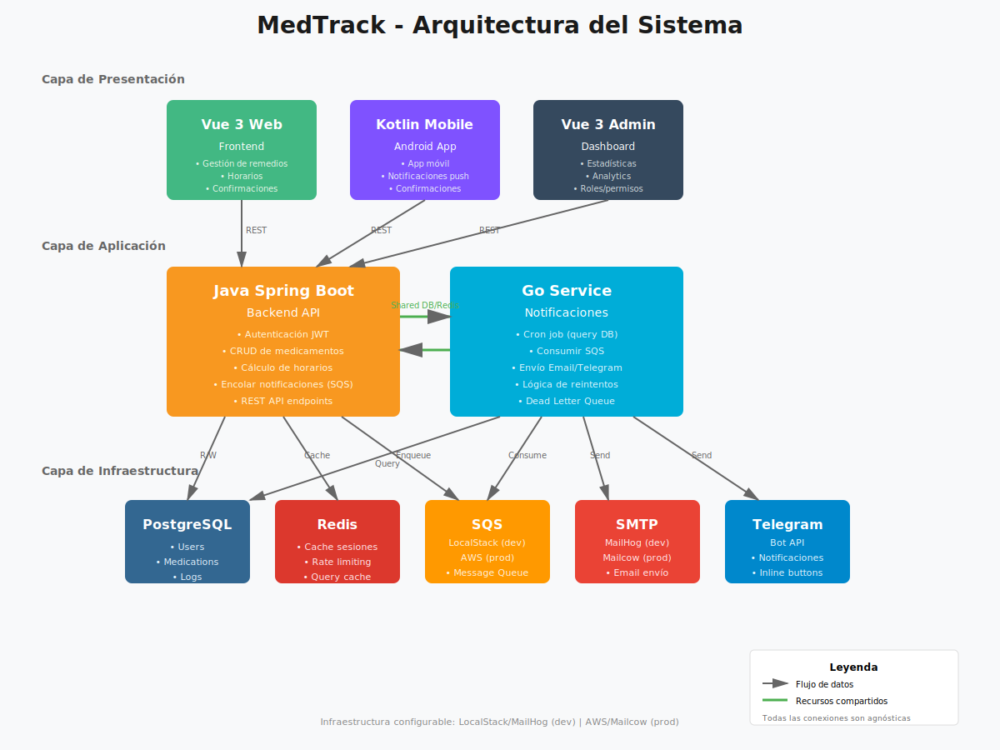

# MedTrack Backend 💊

Backend del sistema MedTrack - Una aplicación de recordatorio de medicamentos que ayuda a los usuarios a gestionar sus tratamientos médicos mediante notificaciones programadas por Email y Telegram.

## 📋 Descripción

MedTrack permite a los usuarios:
- Autenticarse de forma segura mediante JWT
- Registrar medicamentos con horarios específicos en su zona horaria local
- Configurar recordatorios recurrentes (diarios, semanales) o con fecha de finalización
- Recibir notificaciones automáticas por Email y Telegram cuando es hora de tomar sus medicamentos
- Confirmar la toma de medicamentos mediante la interfaz web, mobile, o botones en Telegram
- Visualizar estadísticas y adherencia al tratamiento

## 🏗️ Arquitectura del Sistema



El sistema está compuesto por:

- **Backend API (Java Spring Boot)**: Gestión de usuarios, medicamentos y autenticación
- **Servicio de Notificaciones (Go)**: Procesamiento asíncrono de notificaciones mediante SQS
- **Frontend Web (Vue 3)**: Interfaz de usuario para gestión de medicamentos
- **App Mobile (Kotlin)**: Aplicación Android para acceso móvil
- **Admin Dashboard (Vue 3)**: Panel de administración con estadísticas y analytics
- **Infraestructura**: PostgreSQL, Redis, SQS, SMTP, Telegram Bot API

### Flujo de Notificaciones

1. El backend calcula los próximos horarios de medicamentos
2. Un cron job en el servicio Go consulta la DB cada 15-30 minutos
3. Los mensajes se encolan en AWS SQS (o LocalStack para desarrollo)
4. El servicio Go consume los mensajes y envía notificaciones por Email o Telegram
5. Si falla, SQS reintenta automáticamente hasta un máximo configurado
6. Mensajes fallidos van a Dead Letter Queue para inspección manual

## 🛠️ Stack Tecnológico

### Backend
- **Java 21**
- **Spring Boot** (Framework principal)
- **Spring Data JPA** (Persistencia)
- **Spring Security + JWT** (Autenticación)
- **PostgreSQL** (Base de datos)
- **Redis** (Cache de sesiones, rate limiting)
- **Lombok** (Reducción de boilerplate)

### Infraestructura
- **Docker & Docker Compose** (Containerización)
- **AWS SQS** / **LocalStack** (Message Queue)
- **MailHog** (dev) / **Mailcow** (prod) (SMTP)
- **Telegram Bot API** (Notificaciones)

### Servicios Adicionales
- **Servicio de Notificaciones en Go** (repositorio separado)
- **Frontend Vue 3** (repositorio separado)
- **App Mobile Kotlin** (repositorio separado)

## 📁 Estructura del Proyecto

```
medtrack-backend/
├── src/
│   ├── main/
│   │   ├── java/
│   │   │   └── com/medtrack/
│   │   │       ├── controller/
│   │   │       ├── service/
│   │   │       ├── repository/
│   │   │       ├── model/
│   │   │       ├── dto/
│   │   │       ├── config/
│   │   │       └── security/
│   │   └── resources/
│   │       └── application.properties
│   └── test/
├── diagram.svg
├── Dockerfile
├── docker-compose.yml
├── .env.example
└── README.md
```

## 🚀 Requisitos Previos

- **Docker** y **Docker Compose** instalados
- **Java 21** (solo para desarrollo local sin Docker)
- **IntelliJ IDEA** (recomendado) u otro IDE compatible
- **Maven** (generalmente incluido en el IDE)

## ⚙️ Configuración Inicial

### 1. Clonar el repositorio

```bash
git clone https://github.com/tu-usuario/medtrack-backend.git
cd medtrack-backend
```

### 2. Configurar variables de entorno

Crea un archivo `.env` en la raíz del proyecto basándote en `.env.example`:

```env
# Database Configuration
DB_USER=medtrack_user
DB_PASSWORD=medtrack_pass_dev
DB_NAME=medtrack_db
DB_PORT=5432

# Redis Configuration
REDIS_HOST=localhost
REDIS_PORT=6379

# SQS Configuration (LocalStack for dev)
SQS_ENDPOINT=http://localhost:4566
SQS_REGION=us-east-1
SQS_QUEUE_NAME=medtrack-notifications

# SMTP Configuration
SMTP_HOST=localhost
SMTP_PORT=1025

# JWT Configuration
JWT_SECRET=your_super_secret_jwt_key_here_change_in_production
JWT_EXPIRATION=86400000

# Telegram Bot (opcional)
TELEGRAM_BOT_TOKEN=your_bot_token_here
```

⚠️ **Importante**: Modifica las credenciales de la base de datos y el JWT secret en producción.

## 🐳 Ejecución con Docker (Recomendado)

### Opción 1: Levantar todo el stack (Infraestructura completa)

```bash
docker-compose up --build
```

Esto levantará:
- PostgreSQL en el puerto 5432
- Redis en el puerto 6379
- LocalStack (SQS) en el puerto 4566
- MailHog en el puerto 8025 (Web UI)
- La aplicación Backend en el puerto 8080

Para correr en segundo plano:
```bash
docker-compose up -d --build
```

### Opción 2: Solo la infraestructura (para desarrollo local)

Si prefieres correr tu código Java localmente desde el IDE:

```bash
docker-compose up db redis localstack mailhog
```

Luego ejecuta la aplicación desde IntelliJ IDEA normalmente.

### Comandos útiles de Docker

```bash
# Ver logs de la aplicación
docker-compose logs -f app

# Ver logs de todos los servicios
docker-compose logs -f

# Detener todos los servicios
docker-compose down

# Detener y eliminar volúmenes (⚠️ borra los datos de la DB)
docker-compose down -v

# Reconstruir imágenes
docker-compose build --no-cache

# Ver estado de los servicios
docker-compose ps
```

### Acceder a los servicios

- **Backend API**: http://localhost:8080
- **MailHog Web UI**: http://localhost:8025 (para ver emails enviados)
- **PostgreSQL**: localhost:5432
- **Redis**: localhost:6379
- **LocalStack**: localhost:4566

## 💻 Desarrollo Local (sin Docker para la app)

### 1. Levantar la infraestructura

```bash
docker-compose up db redis localstack mailhog
```

### 2. Configurar `application.properties`

Asegúrate de que tu archivo `application.properties` apunte a localhost:

```properties
# Database
spring.datasource.url=jdbc:postgresql://localhost:5432/medtrack_db
spring.datasource.username=medtrack_user
spring.datasource.password=medtrack_pass_dev

# Redis
spring.redis.host=localhost
spring.redis.port=6379

# SQS
aws.sqs.endpoint=http://localhost:4566
aws.sqs.region=us-east-1
aws.sqs.queue-name=medtrack-notifications

# SMTP
spring.mail.host=localhost
spring.mail.port=1025
```

### 3. Ejecutar desde IntelliJ IDEA

1. Abre IntelliJ IDEA
2. File → Open → Selecciona la carpeta del proyecto
3. Espera a que Maven descargue las dependencias
4. Asegúrate de que el SDK esté configurado en Java 21
5. Busca la clase principal (anotada con `@SpringBootApplication`)
6. Click derecho → Run

### 4. Ejecutar desde terminal con Maven

```bash
./mvnw spring-boot:run
```

### 5. Compilar JAR y ejecutar

```bash
./mvnw clean package
java -jar target/medtrack-backend-0.0.1-SNAPSHOT.jar
```

## 🗄️ Base de Datos

### Modelo de Datos

**Users**
- id, email, password_hash, timezone, telegram_chat_id, created_at

**Medicines**
- id, user_id, name, dosage, scheduled_time, days_of_week, notification_method, created_at

**MedicineLogs**
- id, medicine_id, user_id, scheduled_time, taken_at, status, notification_sent_at

### Acceder a PostgreSQL

Para acceder a la base de datos directamente:

```bash
docker exec -it medtrack-db psql -U medtrack_user -d medtrack_db
```

### Migraciones

La base de datos se genera automáticamente usando **JPA/Hibernate** a partir de las entidades definidas con **Lombok**.

## 🧪 Testing

Ejecutar tests:

```bash
./mvnw test
```

Con Docker:
```bash
docker-compose run --rm app ./mvnw test
```

Ejemplo de test con autenticación JWT:

```java
@Test
void shouldReturnAllMedicines() throws Exception {
    Medicine m1 = new Medicine();
    m1.setName("Ibuprofeno");
    m1.setDosage("600mg");

    Medicine m2 = new Medicine();
    m2.setName("Aspirina");
    m2.setDosage("100mg");

    medicineRepository.save(m1);
    medicineRepository.save(m2);

    mockMvc.perform(get("/api/medicines/all")
                    .header("Authorization", "Bearer " + token))
            .andExpect(status().isOk())
            .andExpect(jsonPath("$", hasSize(2)))
            .andExpect(jsonPath("$[0].name").value("Ibuprofeno"))
            .andExpect(jsonPath("$[1].name").value("Aspirina"));
}
```

## 📡 API Endpoints

### Autenticación
- `POST /api/auth/register` - Registro de usuario
- `POST /api/auth/login` - Login (retorna JWT)

### Medicamentos
- `GET /api/medicines/all` - Listar todos los medicamentos (admin)
- `GET /api/medicines/user/{userId}` - Medicamentos de un usuario
- `POST /api/medicines` - Crear medicamento
- `PUT /api/medicines/{id}` - Actualizar medicamento
- `DELETE /api/medicines/{id}` - Eliminar medicamento

### Logs
- `GET /api/logs/user/{userId}` - Historial de toma de medicamentos
- `POST /api/logs/confirm` - Confirmar toma de medicamento

## 🔐 Seguridad

- Autenticación mediante **JWT**
- Sesiones cacheadas en **Redis**
- Rate limiting por usuario
- Passwords hasheados con **BCrypt**
- CORS configurado para permitir solo dominios autorizados

## 🚀 Deploy a Producción

### Con AWS

Este proyecto está preparado para deployar en AWS usando:
- **Amazon ECS/EKS** para orquestación de contenedores
- **Amazon ECR** para el registro de imágenes Docker
- **Amazon RDS for PostgreSQL** para la base de datos administrada
- **Amazon ElastiCache for Redis** para cache
- **Amazon SQS** para message queue
- **Amazon SES** para envío de emails

### Cambios necesarios para producción

1. Cambiar `application-prod.properties`:
```properties
aws.sqs.endpoint=https://sqs.us-east-1.amazonaws.com
spring.mail.host=smtp.sendgrid.net
spring.datasource.url=jdbc:postgresql://rds-endpoint:5432/medtrack
```

2. Configurar secretos en AWS Secrets Manager o variables de entorno

3. Configurar CI/CD con GitHub Actions o AWS CodePipeline

## 📝 Notas de Desarrollo

- Las tablas de la base de datos se crean automáticamente al iniciar la aplicación gracias a Hibernate
- Lombok genera automáticamente getters, setters, constructores y builders
- El Dockerfile usa multi-stage build para optimizar el tamaño de la imagen final
- La aplicación es **agnóstica del proveedor** - funciona igual con LocalStack o AWS real
- Redis se usa para cache de sesiones y rate limiting
- SQS desacopla el envío de notificaciones del flujo principal

## 🤝 Contribuir

Las contribuciones son bienvenidas. Por favor:

1. Fork el proyecto
2. Crea una rama para tu feature (`git checkout -b feature/AmazingFeature`)
3. Commit tus cambios (`git commit -m 'Add some AmazingFeature'`)
4. Push a la rama (`git push origin feature/AmazingFeature`)
5. Abre un Pull Request

## 📄 Licencia

Este proyecto está bajo la Licencia MIT - ver el archivo LICENSE para más detalles.

---

**Estado del Proyecto**: 🚧 En Desarrollo (MVP)

**Roadmap**:
- [x] Autenticación JWT
- [x] CRUD de medicamentos
- [x] Integración con PostgreSQL
- [ ] Integración con Redis
- [ ] Integración con SQS
- [ ] Servicio de notificaciones en Go
- [ ] Notificaciones por Email
- [ ] Notificaciones por Telegram
- [ ] Confirmación de toma de medicamentos
- [ ] Handleo de refills
- [ ] Dashboard de administración
- [ ] App mobile
- [ ] Deploy a AWS